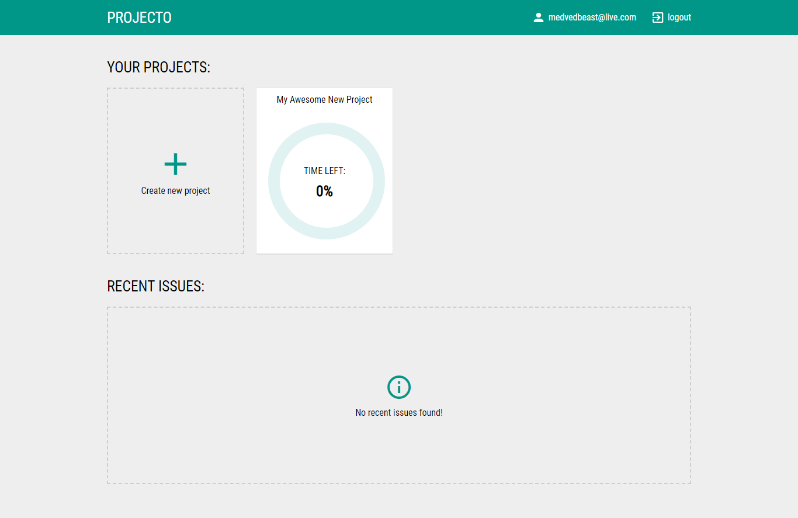
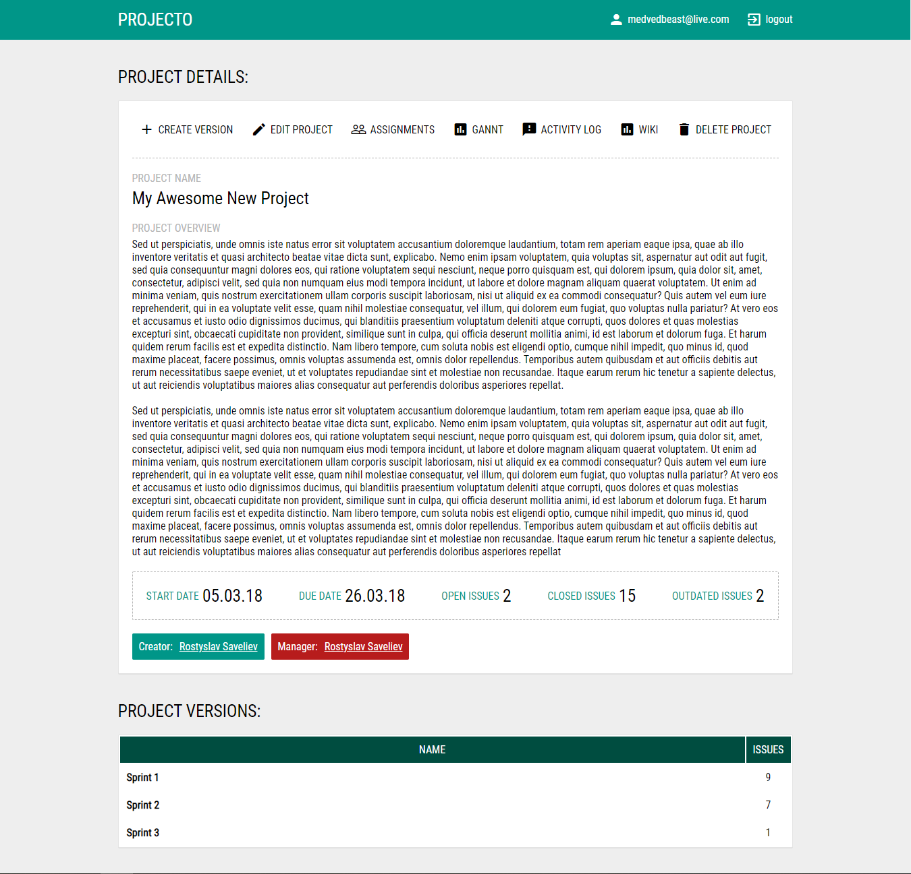
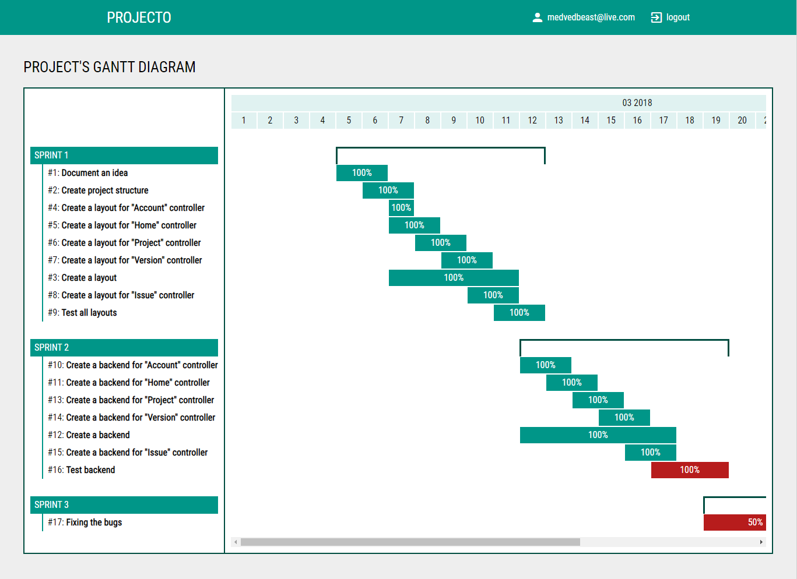
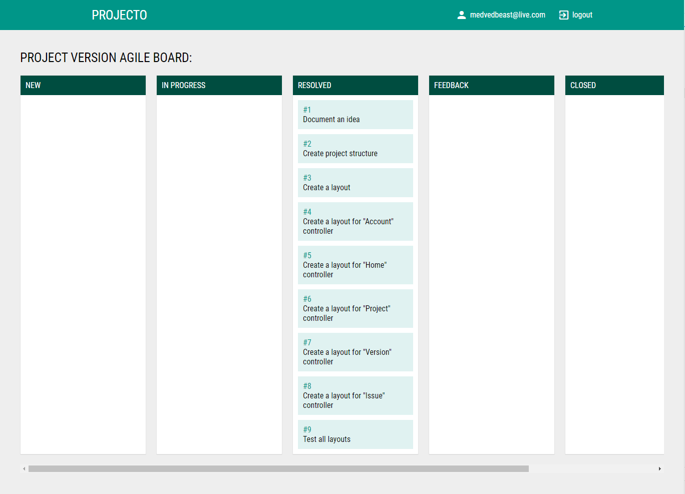

# Projecto

An application to help develope and manage application using AGILE methodology. It helps keep sprints in order, track issues and contains helpfull features as Gannt diagram, project backlog, project description and wiki as well as agile-board view of tasks.

